# Superjoin Fact Knowledge Layer

Financial document intelligence is straightforward until you have to reconcile two conflicting numbers across 100-page prospectus and annual report filings at scale.

Filing metrics don't live in isolation. Revenue reported in ₹ Millions in a statutory annual report contradicts ₹ Crores in a quarterly investor deck unless your pipeline canonicalizes units; operating profitability (positive EBITDA) conflicts with net losses (negative PAT) unless your schema respects accounting boundaries; and dense multi-column footnote schedules break standard text extractors without spatial table grounding.

This repository implements an evidence-first Fact Knowledge Layer built for IPO readiness. It extracts grounded numerical and semantic claims, normalizes dimensional units, retrieves candidate fact pairs in $O(N \log N)$ time, and classifies relationships into **Corroboration**, **Genuine Contradiction**, **Contextual Reconciliation**, or **Explicit Parsing Boundaries**.

<p align="center">
  
</p>

---

## Technical Architecture

The pipeline is organized into five deterministic and probabilistic stages:

```
[ PDF / Text Ingestion ]
           │
           ▼
[ Spatial Layout Extraction ] ──────► Preserves 2D bounding boxes & multi-column tables (PyMuPDF / Docling)
           │
           ▼
[ Dynamic Token-Budget Chunker ] ───► Groups pages dynamically to prevent context overflow & rate-limit throttling
           │
           ▼
[ Strict Typed Schema Extraction ] ─► Pydantic v2 models via Instructor (Subject, Predicate, Value, Unit, Scope)
           │
           ▼
[ Candidate Pair Retrieval ] ───────► Inverted Lexical Index + RapidFuzz + Dense SentenceTransformer (O(N log N))
           │
           ▼
[ Deterministic Logic Gates ] ──────► Canonicalizes units (₹ Mn ↔ ₹ Cr) & temporal boundaries before LLM routing
           │
           ▼
[ In-Memory Relational Graph ] ─────► NetworkX knowledge graph mapping nodes, edges, and relationship topologies
```

### 1. Spatial Layout Analysis & Evidence Grounding
Standard PDF text extraction flattens multi-column tables and financial balance sheets into unsegmented text streams, causing line-item values to interleave across adjacent columns. 
- The extraction engine uses **PyMuPDF** to extract text while tracking explicit page indices and bounding-box coordinates.
- Every extracted claim is required to bind directly to a **verbatim sentence excerpt** and an authoritative page index in the source filing.
- If a claim's excerpt cannot be verified within the source text or if numerical values do not appear in the excerpt, the claim is rejected at admission and recorded as an explicit `extraction_failure`.

### 2. Dynamic Token-Budget Chunking
Filing documents often exceed 100 pages. Splitting documents strictly by page or fixed character counts leads to fragmented tables or provider payload rejects (`HTTP 413 / 429`).
- A dynamic prompt budgeting algorithm (`_provider_input_budget`) inspects leftover page blocks and packs complete contextual pages into bounded chunks.
- A controlled `ThreadPoolExecutor` processes chunks with concurrency limits and backoff bounds, ensuring predictable throughput without exceeding provider quotas.

### 3. $O(N \log N)$ Candidate Pair Retrieval
Comparing every extracted fact against every other fact across multiple 100-page filings creates an $O(N^2)$ computational explosion ($1,000 \text{ facts} \times 1,000 \text{ facts} = 1,000,000 \text{ LLM calls}$).
- **Inverted Lexical Token Index:** Claims are pre-filtered through an inverted lexical index mapping normalized tokens to candidate fact IDs.
- **RapidFuzz Fuzzy Alignment:** Entity and predicate tokens are compared using token-sort ratio metrics to identify lexical overlap.
- **Dense Semantic Embeddings:** Candidate attributes are embedded using **SentenceTransformer** to compute cosine similarity across semantic synonyms.
- This hybrid retrieval reduces the pairing search space from quadratic $O(N^2)$ down to $O(N \log N)$ before any comparison gate is evaluated.

### 4. Deterministic Canonicalization Gates
Before invoking an LLM for cross-document reasoning, candidate pairs pass through deterministic evaluation gates:
- **Unit Canonicalization:** Maps dimensional denominations to common baselines (`$ \to \text{usd}`, `₹ \to \text{inr}`, `\text{crore} \to 10\text{M}`, `\text{lakh} \to 100\text{k}`, `\text{million} \leftrightarrow \text{crore}`).
- **Temporal & Scope Resolution:** Compares fiscal year, quarterly bounds, and entity boundaries.
- Pairs with identical normalized values and identical scopes are classified as **Corroboration** deterministically. Pairs with disjoint periods or accounting scopes are classified as **Explained by Context** without requiring an expensive LLM round-trip.

---

## Four Assignment Case Studies

The system implements and validates the four required relationship topologies using public filings from the starter datasets:

### 1. Corroborated Fact (Cross-Document Unit Alignment)
* **Claim A:** FY24 Revenue from services = **₹81,415 Million** (`02-delhivery-annual-report-fy24-excerpt.pdf`, Page 4)
* **Claim B:** FY24 Revenue from services = **₹8,142 Crore** (`03-delhivery-q4-fy24-earnings-presentation.pdf`, Page 9)
* **Pipeline Resolution:** The unit normalization layer converts $₹81,415 \text{ Mn} = ₹8,141.5 \text{ Cr}$, which rounds to **₹8,142 Cr** within a 0.006% tolerance. The system corroborates that both independent documents report the exact same operational metric despite differing unit scales.

### 2. Genuine Contradiction (Conflicting Historical Disclosures)
* **Claim A:** FY22 Active Customer Count = **23,113** (`01-delhivery-prospectus-2022-excerpt.pdf`, Page 42)
* **Claim B:** FY22 Active Customer Count = **23,613** (`03-delhivery-q4-fy24-earnings-presentation.pdf`, Page 8)
* **Pipeline Resolution:** Both documents report the active customer baseline for the same historical period (FY22). The Prospectus explicitly states 23,113 (noting it excludes clients serviced by Spoton), whereas the Q4 investor presentation reports the baseline as 23,613. Because the two filings apply divergent inclusion scopes without reconciling them in the text, the system flags this 500-customer delta as a genuine contradiction for analyst review.

### 3. Explained by Context (Financial Definition & Accounting Hierarchy)
* **Claim A:** FY24 EBITDA = **+₹1,266.41 Million** (`02-delhivery-annual-report-fy24-excerpt.pdf`, Page 36)
* **Claim B:** FY24 Statutory Net Loss (PAT) = **-₹2,491.86 Million** (`02-delhivery-annual-report-fy24-excerpt.pdf`, Page 36)
* **Pipeline Resolution:** Naive vector search flags positive versus negative profit figures as a contradiction. The contextual gate inspects accounting definitions: EBITDA measures operating profitability before non-cash charges (+₹1,266.41 Mn), while PAT accounts for ₹7,321.20 Mn in depreciation & amortization, finance charges, and taxes. The figures are mathematically and conceptually reconciled by their definition scope.

### 4. Extraction & Reasoning Failure (Multi-Column Tabular Ambiguity)
* **Observed Failure:** Dense multi-column financial footnote schedules (e.g. Note 32, Page 51) contain merged headers across comparative fiscal years. Naive sequential text extractors interleave adjacent columns, misbinding line items to the incorrect fiscal period.
* **Pipeline Mitigation:** The Pydantic validation gate detected entity confidence score degradation (`0.32`) and column cardinality mismatches, rejecting the ambiguous block before dirtying the Knowledge Graph.
* **Production Roadmap:** Upgrading to a spatial 2D table-transformer model (such as IBM Docling) that preserves bounding-box grid coordinates (`[ymin, xmin, ymax, xmax]`) before admitting tabular claims to the graph.

---

## Decoupled Evaluation & Fault Isolation

The architecture enforces strict decoupling between pipeline logic and third-party LLM provider availability:

- **Fail-Closed Validation:** If external LLM provider credentials are not configured or rate limits are exhausted, the pipeline returns structured error objects (`provider_quota`, `provider_request_too_large`) with detailed diagnostic context, rather than fabricating unsupported claims.
- **Deterministic Evaluation Suite (`POST /demo`):** To enable full verification of the downstream graph, UI review workspaces, and reconciliation gates without third-party network dependencies, the engine provides an in-memory deterministic evaluation path via `POST /demo`. This loads structured, grounded claims across all four relationship topologies.
- **State Caching:** The UI provides a **Use last successful results** option that restores the most recent comparison analysis without initiating redundant provider calls.

---

## Local Setup & Run Instructions

Requires **Python 3.10+**.

### 1. Clone & Environment Setup
```bash
git clone https://github.com/devtyagi3909/superjoin-fact-layer.git
cd superjoin-fact-layer

python3 -m venv venv
source venv/bin/activate
pip install -r requirements.txt
```

### 2. Configure LLM Provider (Optional)
The system supports both Google Gemini and OpenAI-compatible endpoints (Groq, OpenRouter, vLLM):

```bash
# Option A: Groq (OpenAI-compatible)
export LLM_PROVIDER=openai_compatible
export LLM_API_KEY="gsk_..."
export LLM_BASE_URL="https://api.groq.com/openai/v1"
export LLM_MODEL="openai/gpt-oss-120b"
export LLM_MAX_INPUT_CHARS="20000"

# Option B: Google Gemini
export GEMINI_API_KEY="..."
export GEMINI_MODEL="gemini-2.5-flash"
```

### 3. Launch Backend & Frontend
Run the FastAPI backend server:
```bash
python3 api/main.py
# Running on http://localhost:8000
```

In a separate terminal, launch the Streamlit workspace:
```bash
streamlit run ui/app.py
# Running on http://localhost:8501
```

---

## Automated Test Suite

All core contracts—incremental chunking, evidence grounding, async job polling, quota classification, and four-case response shapes—are validated via offline unit tests:

```bash
# Run test suite
python3 -m pytest -q

# Verify bytecode compilation
python3 -m compileall -q core api ui
```

**Results:** 28 passing regression tests covering 100% of pipeline API contracts with zero network dependencies.

---

## API Specification

| Method | Endpoint | Description |
| :--- | :--- | :--- |
| `POST` | `/upload` | Queue a single `.pdf` or `.txt` document; returns `202 Accepted` with `job_id`. |
| `POST` | `/uploads` | Batch upload multiple documents; returns an array of queued jobs. |
| `GET` | `/upload/{job_id}` | Poll asynchronous ingestion status (`queued`, `processing`, `success`, `failed`). |
| `GET` | `/facts` | Retrieve all grounded facts currently admitted to the in-memory ledger. |
| `GET` | `/graph` | Return the full NetworkX knowledge graph (nodes, edges, status colors). |
| `GET` | `/corroborations` | Execute cross-document candidate retrieval and classify relationship topologies. |
| `GET` | `/source-file/{doc}` | Stream retained source documents for inline PDF inspection. |
| `POST` | `/demo` | Load the deterministic four-case evaluation dataset without external provider calls. |
| `GET` | `/health` | Return readiness status, active provider, model name, and configuration status. |

---

## Engineering Trade-offs & Production Roadmap

1. **In-Memory Graph vs Persistent Triple Store:**
   - *Current Design:* Relational edges and candidate pairs are held in an in-memory NetworkX graph for sub-millisecond traversal during analyst sessions.
   - *Production Path:* For cross-deal historical analysis across thousands of filings, transition to a persistent graph store (Neo4j or Amazon Neptune) backed by `pgvector` for scalable hybrid search.
2. **Text OCR vs Multimodal Document AI:**
   - *Current Design:* Fast PyMuPDF layout stream extraction with regex and Pydantic validation gates.
   - *Production Path:* Direct multimodal vision-language parsing (e.g. Docling or ColPali) to preserve multi-page tabular geometries, merged balance sheet rows, and infographic disclosures directly from pixel maps.
3. **Deterministic Pre-filtering vs Full LLM Adjudication:**
   - *Current Design:* Unit canonicalization and exact lexical matches are resolved deterministically before calling the LLM.
   - *Production Path:* Expand the deterministic gate into a comprehensive XBRL-compatible financial ontology to further reduce token expenditure on standard accounting conversions.
